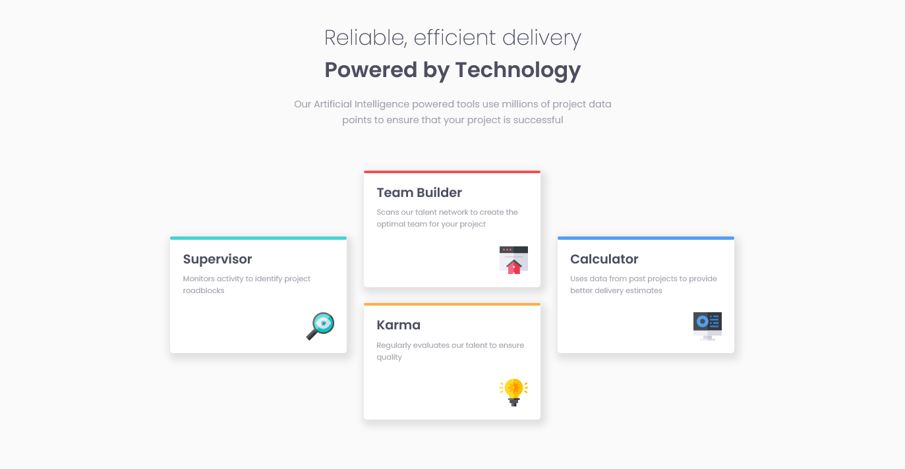

# Frontend Mentor - Four card feature section solution

This is a solution to the [Four card feature section challenge on Frontend Mentor](https://www.frontendmentor.io/challenges/four-card-feature-section-weK1eFYK). Frontend Mentor challenges help you improve your coding skills by building realistic projects. 

### Screenshot

### Links
- Solution URL:(https://github.com/A-n-i-e/Four-card-feature-section-solution)
- Live Site URL:(https://a-n-i-e.github.io/Four-card-feature-section-solution/)

### Built with

- Semantic HTML5 markup
- CSS custom properties
- CSS Grid

## Author
- Frontend Mentor - [@A-n-i-e](https://www.frontendmentor.io/profile/A-n-i-e)

#Trust in God!
s
